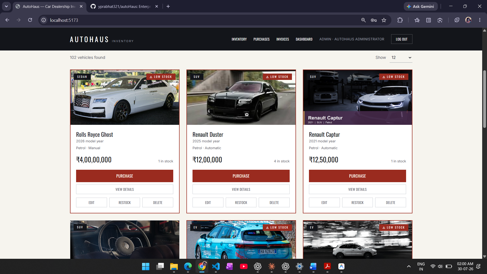
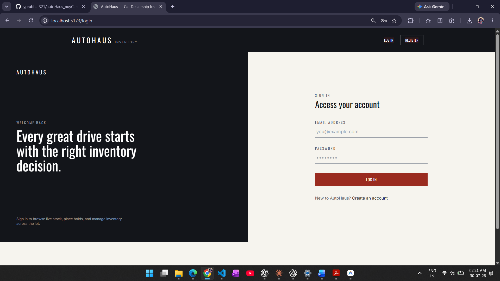
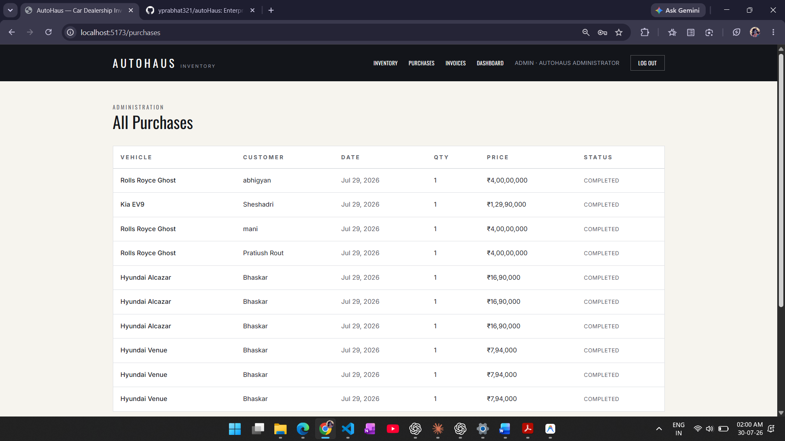
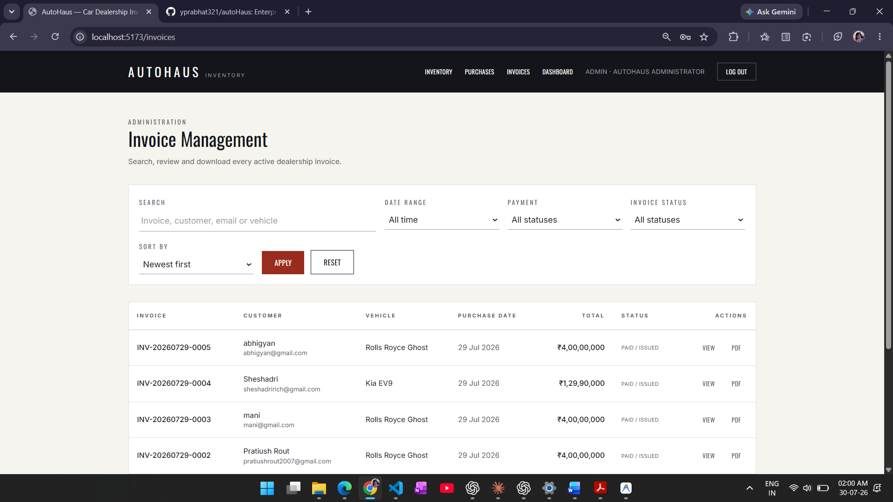
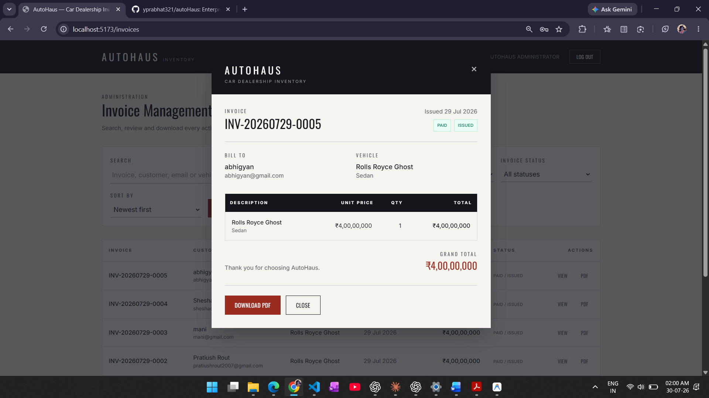
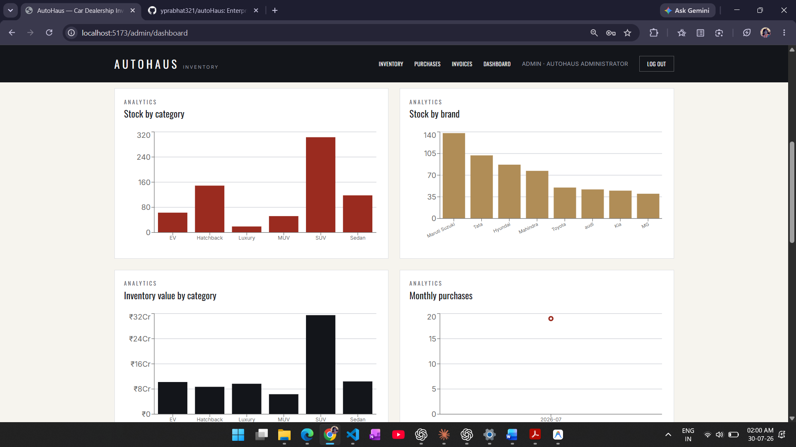
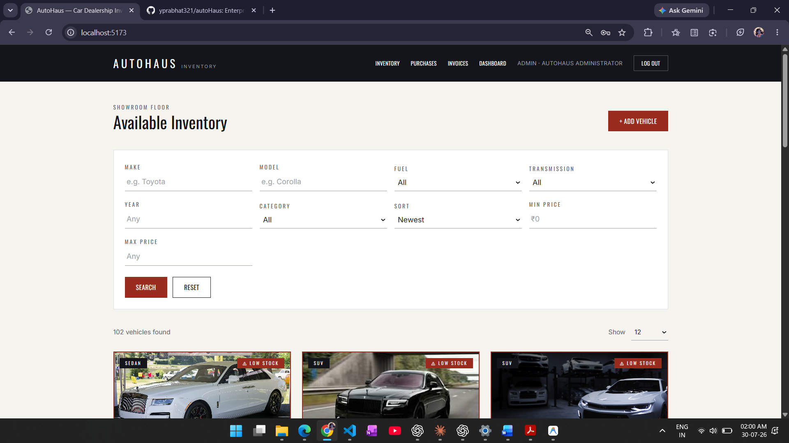
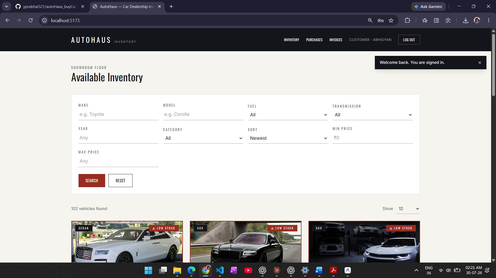

# AutoHaus - Car Dealership Inventory & Sales Management System

AutoHaus is an enterprise-grade, full-stack car dealership inventory management and purchase system. Built with Node.js, Express, MongoDB Atlas, and React (Vite + Tailwind CSS), the project strictly follows Test-Driven Development (TDD) principles, clean architecture patterns, and structured AI pair-programming workflows.

---

## 🔑 Demo Admin Credentials

Use the following account to review the administrator workflow in the demo environment:

| **Role**  | **Email**              | **Password** |
| --------- | ---------------------- | ------------ |
| **Admin** | `admin@dealership.com` | `Admin@123`  |

---

## 🌐 Live Demo

| Service | URL |
| ------- | --- |
| **Frontend (Live)** | [https://frontend-ten-theta-83.vercel.app](https://frontend-ten-theta-83.vercel.app) |
| **Backend API (Live)** | [https://backend-alpha-three-88.vercel.app/api/health](https://backend-alpha-three-88.vercel.app/api/health) |
| **GitHub Repo** | [https://github.com/yprabhat321/autoHaus_carHouse](https://github.com/yprabhat321/autoHaus_carHouse) |

---

## 📸 Application Showcase

### 🛡️ Admin Portal Showcase

The Admin portal provides complete dealership oversight, inventory operations, sales reporting, and transaction auditing.

#### 1. Inventory Management

| Catalogue actions | Search, filters, and vehicle creation |
| --- | --- |
|  |  |

#### 2. Purchase Records



#### 3. Invoice Management

| Searchable invoice register | Invoice review and PDF download |
| --- | --- |
|  |  |

#### 4. Analytics Dashboard

| Inventory and sales summary | Category, brand, value, and purchase analytics |
| --- | --- |
|  |  |

---

### 🛒 Customer Portal Showcase

The Customer portal allows buyers to sign in, explore live vehicle stock, apply multi-parameter filters, complete purchases, and view invoices.

| Sign in | Showroom floor and vehicle catalogue |
| --- | --- |
|  |  |

---

## 🛠️ Process & Technical Guidelines

### 1. Test-Driven Development (TDD)
- All backend core business logic and API contracts were implemented following a strict **Red-Green-Refactor** development loop.
- **Red Phase**: Failing unit/integration test specifications were written first in `backend/tests`.
- **Green Phase**: Minimal, robust code was implemented to fulfill contract requirements.
- **Refactor Phase**: Code was optimized for maintainability and readability without breaking existing test suites.

### 2. Clean Coding Practices & SOLID Principles
- **Separation of Concerns**: Modular layer division across routes, controllers, services, middleware, and schemas.
- **Single Responsibility Principle (SRP)**: Distinct services handle PDF generation (`createInvoicePdf.js`), purchase execution (`purchaseService.js`), and inventory audit logging.
- **Defensive Design**: Multi-layer validations, transactional safety against overselling, and centralized Express error handlers.

### 3. Git & Version Control
- Structured commit history narrating the step-by-step progress from project setup, TDD test creation, service implementation, UI polish, to documentation.
- Informative and standardized commit messages.

### 4. AI Usage Policy & Transparent Co-authorship
- AI tooling was integrated into the development lifecycle for scaffolding boilerplate, drafting unit test cases, and refining UI CSS layouts.
- **AI Co-authorship**: Commits involving AI assistance include standard Git co-author trailers:
  ```text
  Co-authored-by: Google Antigravity <antigravity@google.com>
  ```
- **PROMPTS.md**: Comprehensive prompt log maintained in [PROMPTS.md](PROMPTS.md) detailing all prompt chains, AI tool usage, and development outcome notes.

---

## 🧪 Test Suite & Verification Report

To run the backend automated test suite:
```bash
cd backend
npm test
```

### Test Results Summary
| Test Suite | File | Status | Coverage Focus |
| --- | --- | --- | --- |
| **Auth Integration** | `tests/integration/auth.integration.test.js` | PASS | Registration, password hashing, JWT creation, role protection |
| **Vehicle Integration** | `tests/integration/vehicles.integration.test.js` | PASS | RBAC, pagination, filtering, stock depletion, PDF invoice generation |
| **Auth Unit** | `tests/unit/auth.controller.test.js` | PASS | Controller request/response contracts, duplicate email handling |
| **Vehicle Unit** | `tests/unit/vehicle.controller.test.js` | PASS | CRUD operations, stock depletion safety, restock increments |

**Summary**: 4 Test Suites Passed, 35 Tests Passed (100% Core Business Logic Verification).

---

## 💻 Local Setup & Installation

### Prerequisites
- Node.js (v18+)
- MongoDB Atlas or local MongoDB instance

### 1. Clone Repository
```bash
git clone https://github.com/yprabhat321/autoHaus_carHouse.git
cd autoHaus_carHouse
```

### 2. Backend Setup
```bash
cd backend
npm install
```

> ✅ **The `.env` file is pre-configured** — no manual setup needed. Just install and run.

Run backend server:
```bash
npm run dev
```

### 3. Frontend Setup
```bash
cd ../frontend
npm install
```

> ✅ **The `.env` file is pre-configured** — no manual setup needed. Just install and run.

Run frontend server:
```bash
npm run dev
```

Open **[http://localhost:5173](http://localhost:5173)** in your browser.

---

## 🤖 My AI Usage

### 1. Tools Utilized
- **Google Antigravity AI**: Used for project structure planning, TDD execution, environment setup, and pair programming during debugging sessions.
- **Claude (Claude 3.7 Sonnet)**: Assisted in writing complex Express middleware, PDF receipt generation logic, and modular React components.
- **OpenAI Codex**: Used for generating initial TDD test cases, Jest assertion boilerplates, and code completion suggestions.

### 2. How AI Was Applied
- **Architecture & Setup**: Planned overall architecture and used AI tools to generate starter configurations for Express, Mongoose, Vite, and Tailwind CSS.
- **TDD Test Creation**: Specified test criteria for authentication and stock depletion rules, using AI tools to draft failing Jest test suites prior to writing business logic.
- **Feature Implementation**: Directed implementation of services like `purchaseService.js` and `createInvoicePdf.js`, refining AI suggestions to enforce strict validation and transaction boundary rules.
- **UI Components**: Leveraged AI for responsive Tailwind layouts for vehicle cards, search filter bars, and admin analytics dashboards.

### 3. Reflection
Integrating AI tools into the development workflow acted as an efficient pair programmer. It accelerated boilerplate generation and UI formatting while maintaining complete control over code quality, architecture integrity, and strict TDD discipline.
